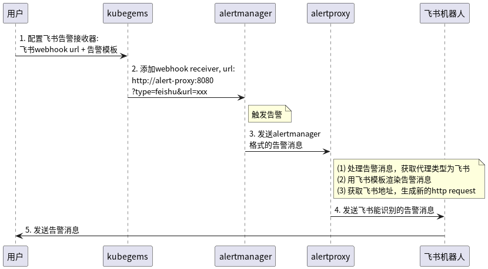

# 开发指南

## 告警处理流程


## 如何开发新的告警代理

1. 实现`AlertProxy`接口，
```go
type AlertProxy interface {
	// Do a new alert requet
	DoRequest(params url.Values, alert Alert) error
}
```
- `DoRequest`用来提取本次webhook的数据，并通过你的AlertProxy实例中的模板及原生告警内容，渲染生成新的http request，然后使用自己的客户端发起请求。
1. 在`Init()`函数中注册该告警代理
```go
func Init(cfgs *config.ProxyConfigs) {
	for _, v := range cfgs.Templates {
		if _, ok := alertProxyMap[v.Type]; ok {
			log.Fatalf("duplicated alert proxy type: %s", v.Type)
		}
		tmpl := template.Must(template.New(string(v.Type)).Parse(v.Template))
		switch v.Type {
		case config.Feishu:
			alertProxyMap[v.Type] = NewFeishuRobot(tmpl)
		case config.AliyunMsg:
			alertProxyMap[v.Type] = NewAliyunMsg(tmpl)
		case config.AliyunVoice:
			alertProxyMap[v.Type] = NewAliyunVoice(tmpl)
		default:
			log.Fatalf("unsupported alert proxy type: %s", v.Type)
		}
	}
}
```
3. 将你的告警代理模板，填写在[config/deploy/alertproxy.yaml](config/deploy/alertproxy.yaml)文件中。
- type: 代理类型
- template: 要渲染的模板内容，你可以在`DoRequest`渲染模板

## 运行&部署
1. 本地运行
自行修改[config/deploy/alertproxy.yaml](config/deploy/alertproxy.yaml)配置
```bash
go run main.go serve
```
2. vscode debug
```bash
$ cat .vscode/launch.json
{
    "version": "0.2.0",
    "configurations": [
        {
            "name": "alertproxy",
            "type": "go",
            "request": "launch",
            "mode": "auto",
            "program": "${workspaceFolder}",
            "args": [
                "serve"
            ]
        }
    ]
}
```
3. 构建镜像
```bash
make docker-build docker-push
```
4. 部署
```bash
make deploy
```
